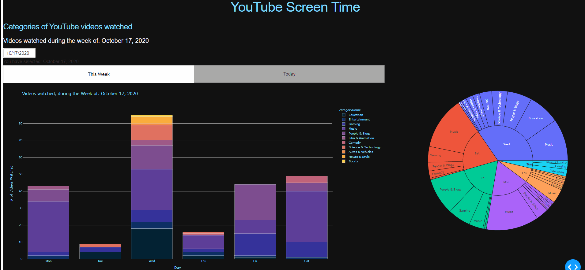

# YouTube_ScreenTime

With this project I aimed to answer 2 questions: 
- What type of videos do I watch? 
- When do I watch these categories? 

Inspired by iPhone's screentime and the recent documentary "The Social Dilemna", which underscores the increase in technology usage. This web dashboard serves a drill down perspective, to examine usage within a given application (i.e. YouTube).

## Demo




### Disclaimer
I would have preferred to plot "watch time" of videos on the Y-Axis, rather than # videos watched (clicked). As this would have more accurately represented how much time was spent on each category. 

However, these properties and other drill down categories (ex. watch history & watch time, and video topics) have been [deprecated](https://developers.google.com/youtube/v3/revision_history#august-11,-2016)

As a result, Google's Takeout Service was used to obtain a list of videos I watched and when they were opened. 

## Getting started 

### Prerequisites
1) Start Google project to generate API Key and choose [YouTube API service](https://console.developers.google.com/)

2) Export your watch history in JSON format, using [Google's Takeout](https://takeout.google.com/settings/takeout) service (this may take a few minutes, you'll be emailed when your export is ready)

### Windows
Install virtualenv to manage packages and create enviroment
```sh
pip install virtualenv
python -m virtualenv .
```
Activate your enviroment
```sh
.\Scripts\activate
```
Install packages:
* google-api-python-client
```sh
pip install google-api-python-client
```

### Mac/Linux
Install virtualenv to manage packages and create enviroment
```sh
pip install virtualenv
python -m virtualenv .
```
Activate your enviroment
```sh
source <your-env>/bin/activate
```
Install packages:
* google-api-python-client
```sh
<your-env>/bin/pip install google-api-python-client
```
### Built with

* pip install plotly
* pip install regex
* pip install pandas
* pip install dash
* pip install datetime
* pip install dateutil.parser

### Sources and references:
* getting started with Google APIs: https://github.com/googleapis/google-api-python-client
* YouTube API v3 Documentation: https://developers.google.com/youtube/v3/docs?hl=en


