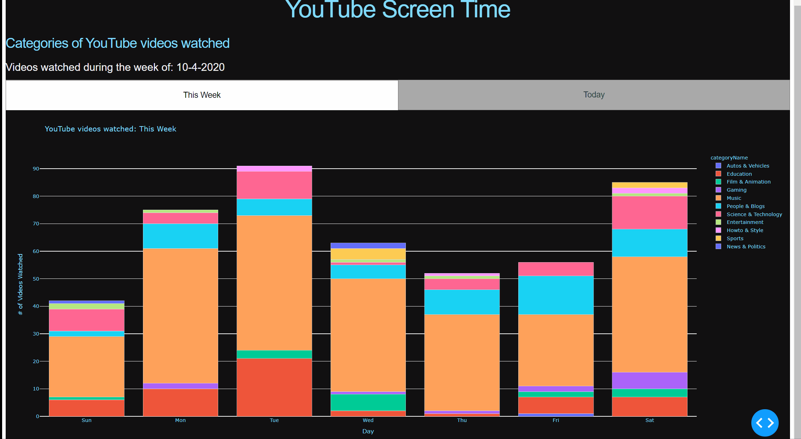

# YouTube_ScreenTime

With this project I aimed to answer 2 questions: 
- What type of videos do I watch? 
- When do I watch said categories? 

Inspired by iPhone's screentime and the recent documentary "The Social Dilemna", which underscores the increase in technology usage.

## Demo
My watch history during the week of 10-4-2020 




## Getting started 

### Prerequisites
1) Start Google project to generate API Key and choose [YouTube API service](https://console.developers.google.com/)

2) Export your watch history in JSON format, using [Google's Takeout](https://takeout.google.com/settings/takeout) service

### Windows
Install virtualenv to manage packages and create enviroment
```sh
pip install virtualenv
python -m virtualenv .
```
Activate your enviroment
```sh
.\Scripts\activate
```
Install packages:
* google-api-python-client
```sh
pip install google-api-python-client
```
##### Additional dependencies

* pip install plotly
* pip install regex
* pip install pandas
* pip install dash
* pip install datetime
* pip install dateutil.parser


### Mac/Linux
Install virtualenv to manage packages and create enviroment
```sh
pip install virtualenv
python -m virtualenv .
```
Activate your enviroment
```sh
source <your-env>/bin/activate
```
Install packages:
* google-api-python-client
```sh
<your-env>/bin/pip install google-api-python-client
```
##### Additional dependencies

* pip install plotly
* pip install regex
* pip install pandas
* pip install dash
* pip install datetime
* pip install dateutil.parser

### Sources and references:
* getting started with Google APIs: https://github.com/googleapis/google-api-python-client
* YouTube API v3 Documentation: https://developers.google.com/youtube/v3/docs?hl=en
