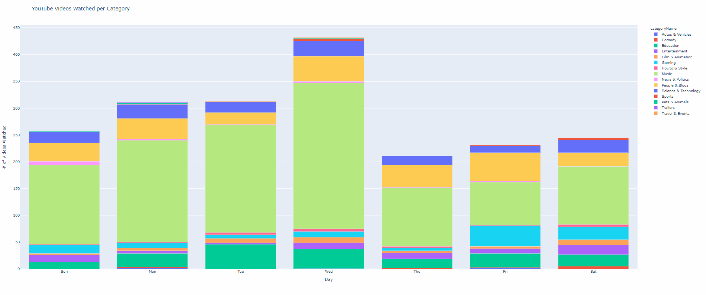

# YouTube_ScreenTime

This project shows you at a high level, how you have you been spending your time on YouTube. 

Using Google's Takeout service, I was able to export my watched videos and timestamps. And used the YouTube API to pull data such as video category.

Currently still working on a few features, such as: a drill down table and a web app, etc.

## Demo
Watch history over the past 2000 videos I've watched 

